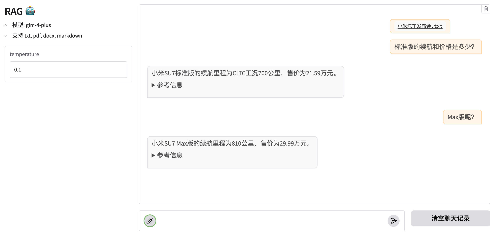

# rag-app
全流程的 RAG demo  

## 特点  

- 同时支持普通对话和上传文件RAG对话模式
- 支持开源模型 glm-4 和 qwen2.5
- 支持OpenAI API调用
- 支持 txt, pdf, docx, markdown 文件类型，并针对中文段落和标点符号做了优化
- 支持对话式的RAG，让RAG也有上下文记忆，RAG 对话始终会以最新上传的文件作为知识库资料
